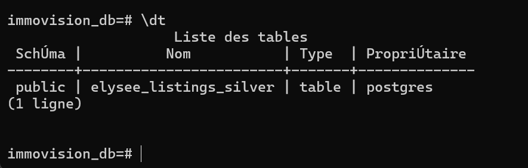
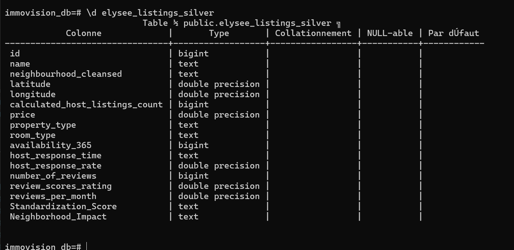
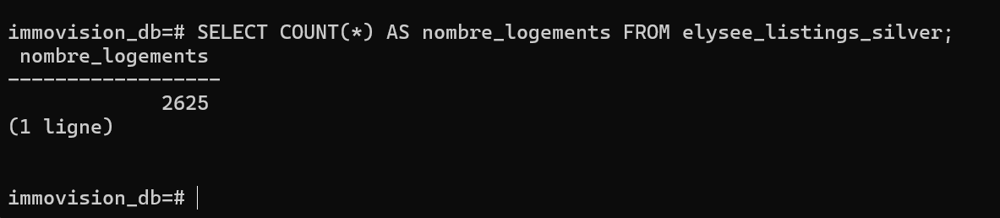
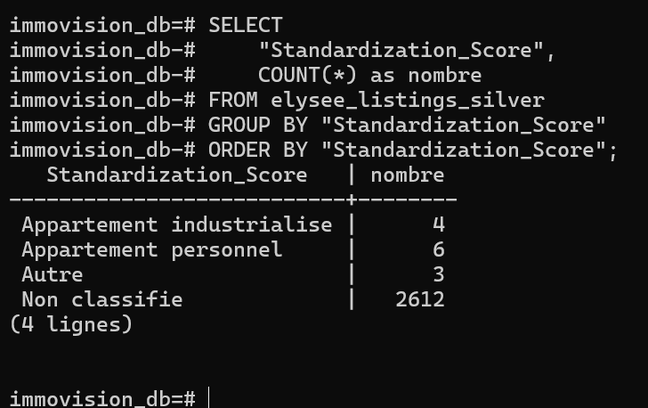
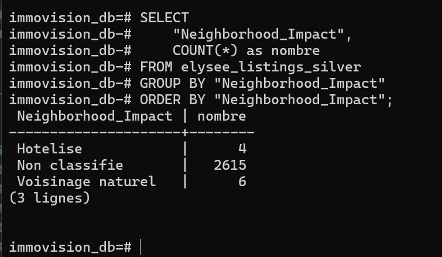
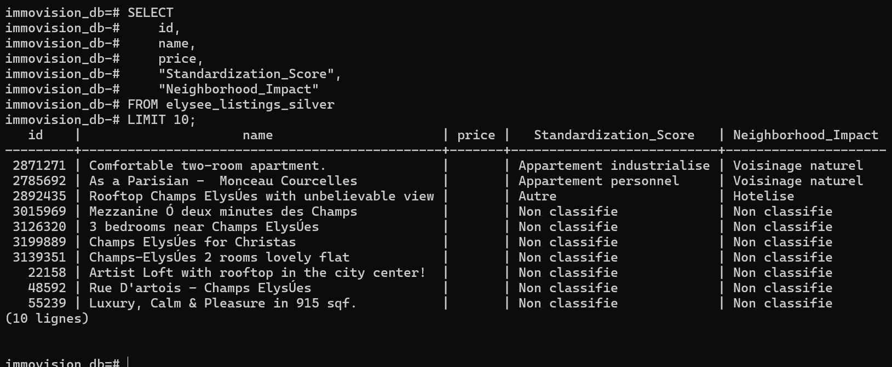

# ImmoVision360 - Data Lake & Pipeline ETL

## Contexte

Pipeline de donnees pour le projet **ImmoVision360** — analyse de l'impact d'Airbnb sur le quartier de l'Elysee (Paris) pour la Maire de Paris. Le pipeline couvre l'ingestion, l'extraction, la transformation (enrichissement IA) et le chargement en base de donnees.

### 3 hypotheses de recherche

| # | Hypothese | Question |
|---|---|---|
| A | **Economique** | Est-ce une economie de partage ou une industrie hoteliere masquee ? |
| B | **Sociale** | Le lien social se brise-t-il au profit de processus automatises ? |
| C | **Visuelle** | Les logements sont-ils devenus des produits financiers steriles ? |

---

## Architecture (Medallion)

```
/ImmoVision360_DataLake
|-- /data
|   |-- /raw                           <-- Zone "Bronze" (donnees brutes)
|   |   |-- /tabular
|   |   |   |-- listings.csv           (81 853 annonces, 70+ colonnes)
|   |   |   +-- reviews.csv            (commentaires bruts)
|   |   |-- /images/                   <-- [ID].jpg (2 494 images)
|   |   +-- /texts/                    <-- [ID].txt (2 625 textes)
|   +-- /processed                     <-- Zone "Silver" (donnees transformees)
|       |-- filtered_elysee.csv        <-- Genere par 04_extract.py
|       +-- transformed_elysee.csv     <-- Genere par 05_transform.py
|
|-- /scripts
|   |-- 01_ingestion_images.py         Ingestion des images depuis les URLs
|   |-- 02_ingestion_textes.py         Ingestion des textes (descriptions)
|   |-- 03_sanity_check.py             Verification de la qualite des donnees
|   |-- 04_extract.py                  Filtrage & selection metier (Pandas)
|   |-- 05_transform.py                Nettoyage + enrichissement IA (Gemini)
|   +-- 06_load.py                     Injection PostgreSQL (SQLAlchemy)
|
|-- /docs
|   +-- /screenshots                   Captures d'ecran (preuve PostgreSQL)
|
|-- .env                               Config secrets (DB + API) - NON COMMITE
|-- .env.example                       Template .env (sans secrets)
|-- .gitignore                         Exclut /data/*, .env, myenv/
|-- README.md                          Ce fichier
|-- README_DATALAKE.md                 Description du Data Lake
|-- README_EXTRACT.md                  Justification du choix d'extraction
+-- README_TRANSFORM.md               Description des transformations IA
```

---

## Prerequisites

| Outil | Version | Usage |
|---|---|---|
| Python | >= 3.10 | Execution des scripts |
| PostgreSQL | >= 14 | Data Warehouse (06_load.py) |
| Cle API Gemini | - | Enrichissement IA (05_transform.py) |

### Dependances Python

```bash
pip install pandas python-dotenv sqlalchemy psycopg2-binary google-generativeai Pillow
```

### Variables d'environnement

Copiez `.env.example` en `.env` et remplissez vos valeurs :

```bash
cp .env.example .env
```

| Variable | Description | Exemple |
|---|---|---|
| `DB_USER` | Utilisateur PostgreSQL | `postgres` |
| `DB_PASSWORD` | Mot de passe PostgreSQL | `mon_mot_de_passe` |
| `DB_HOST` | Hote PostgreSQL | `localhost` |
| `DB_PORT` | Port PostgreSQL | `5432` |
| `DB_NAME` | Nom de la base de donnees | `immovision_db` |
| `GEMINI_API_KEY` | Cle API Google AI Studio | `AIza...` |

---

## Execution du pipeline

### Ordre d'execution

```bash
# Phase 1 : Ingestion (zone Bronze)
python scripts/01_ingestion_images.py
python scripts/02_ingestion_textes.py
python scripts/03_sanity_check.py

# Phase 2 : ETL (zone Silver + Data Warehouse)
python scripts/04_extract.py        # Bronze -> filtered_elysee.csv
python scripts/05_transform.py      # filtered -> transformed_elysee.csv (+ IA)
python scripts/06_load.py           # transformed -> PostgreSQL
```

### Resultats attendus

| Etape | Sortie | Lignes | Colonnes |
|---|---|---|---|
| `04_extract.py` | `filtered_elysee.csv` | ~2 625 | 15 |
| `05_transform.py` | `transformed_elysee.csv` | ~2 500+ | 17 |
| `06_load.py` | Table `elysee_listings_silver` | ~2 500+ | 17 |

---

## Pipeline detaille

| Etape | Script | Description |
|---|---|---|
| 1 | `01_ingestion_images.py` | Telechargement et redimensionnement des images |
| 2 | `02_ingestion_textes.py` | Extraction et nettoyage des descriptions |
| 3 | `03_sanity_check.py` | Verification de l'integrite des donnees |
| 4 | `04_extract.py` | Filtrage quartier Elysee + selection features (3 hypotheses) |
| 5 | `05_transform.py` | Nettoyage NaN/outliers + IA Gemini (image + texte) |
| 6 | `06_load.py` | Injection dans PostgreSQL (`elysee_listings_silver`) |

---

## Data Warehouse PostgreSQL

Apres execution de `06_load.py`, la table `elysee_listings_silver` est creee dans PostgreSQL.

### 📸 Preuves de Fonctionnement

Les screenshots ci-dessous prouvent le bon chargement des donnees dans PostgreSQL :

| Screenshot | Description |
|------------|-------------|
|  | Tables dans la base `immovision_db` |
|  | Structure de `elysee_listings_silver` (17 colonnes) |
|  | 2625 logements charges |
|  | Repartition des valeurs fictives {-1, 0, 1} |
|  | Repartition des valeurs fictives {-1, 0, 1} |
|  | Echantillon de 10 lignes |

---

## ⚠️ Mode Degrade : Donnees Fictives (Valeurs Aleatoires)

**Important** : Les colonnes `Standardization_Score` et `Neighborhood_Impact` contiennent actuellement des **valeurs aleatoires {1, -1, 0}** generees sans utiliser l'API Gemini.

### Pourquoi ?
- Respect des limitations de quota API
- Possibilite de tester l'ensemble du pipeline ETL sans cle API
- Donnees reproductibles (seed=42)

### Pour generer les vraies features IA :
1. Obtenir une cle API Google Gemini : [Google AI Studio](https://makersuite.google.com/app/apikey)
2. Ajouter dans `.env` : `GEMINI_API_KEY=votre_cle`
3. Re-executer : `python scripts/05_transform.py`

Les colonnes passeront alors de valeurs aleatoires a de vraies classifications IA.

---

## Documentation complementaire

**Documentation technique** :
- [README_DATALAKE.md](README_DATALAKE.md) - Architecture du Data Lake (zones Bronze/Silver)
- [README_EXTRACT.md](README_EXTRACT.md) - Étape d'extraction (filtrage Élysée)
- [README_TRANSFORM.md](README_TRANSFORM.md) - Étape de transformation (nettoyage + IA)
- [README_LOAD.md](README_LOAD.md) - Étape de chargement PostgreSQL
- [PIPELINE_COMPLET.md](PIPELINE_COMPLET.md) - Vue d'ensemble complète du pipeline ETL

**Guides pratiques** :
- [docs/GUIDE_SCREENSHOTS.md](docs/GUIDE_SCREENSHOTS.md) - Guide pour reproduire les screenshots
- [docs/REQUETES_SQL_SCREENSHOTS.md](docs/REQUETES_SQL_SCREENSHOTS.md) - Requêtes SQL de validation
